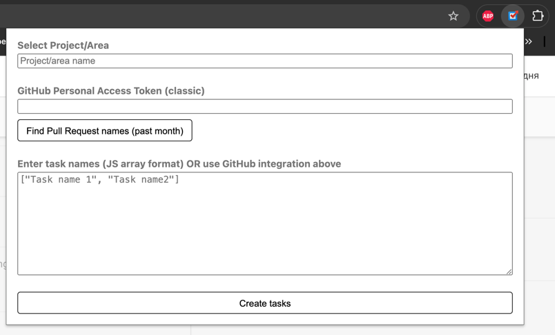
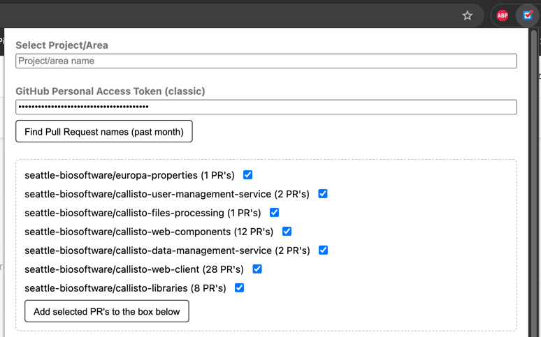

# Chrome extension to automate task creation in Projects (https://app.projects.tm/)

## How to install
- clone repo
- in Chrome go to `chrome://extensions/`
- toggle `Developer mode` in upper right corner
- click `Load unpackaged` in the upper left corner
- select root folder of this repo

## How to use
- open Projects tab
- open extension popup
- enter project/area name (autocomplete is supported)
- enter task names you want to create in a JSON format (JS array)
  Example: `["My task name1", "My task name2"]`
- **Optional** Fetch Pull Requests from GitHub or Azure DevOps
    - Select the source (GitHub or Azure DevOps)
    - For GitHub:
        - input personal access token (Use classic. Fine grained won't have access to private organization repos)
        - click `Find Pull Request names (past month)` button
        - preview PR's found in each repo
        - select all repositories you want to include
        - click `Add selected PR's to the box below` to transfer PR names to the task names box
    - For Azure DevOps:
        - input personal access token
        - click `Find from Azure DevOps (past month)` button
        - preview PR's found in each repo
        - select all repositories you want to include
        - click `Add selected PR's to the box below` to transfer PR names to the task names box
- click `Create tasks`

